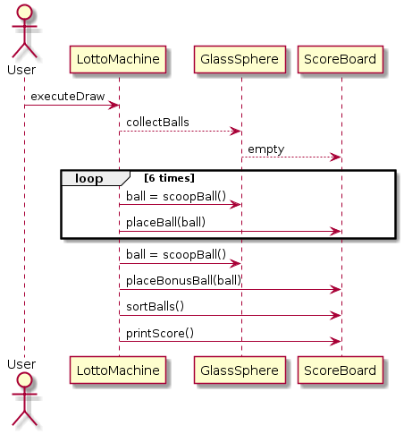

# Introduction

This exercise is part of the TAS course at the HAN University of Applied Sciences. It is based on an exercise from the Course OOPD.

You'll probably recognize this exercise from OOPD, in which you had to implement a Lotto Machine in Java. This time you will
need to implement it in TypeScript.

## Functional specification
A *Lotto Machine* consists of a *Glass Sphere*, containing 45 *Balls* numbered 1 to 45 and a *Scoreboard*, consisting of seven *Glass Cups*.

In case of a Lotto draw the control part rotates the glass sphere and ensures one ball is scooped into each of the seven cups. The number on the ball that is 
scooped into the seventh cup is called the *Bonus Number.*

When announcing the drawn numbers, the first six numbers are called in increasing order. The *Bonus Number* is mentioned last.

> The outcome of a Lotto draw is presented as follows:    4   11   15   27   31   40   Bonus number: 18
>

## Technical Specification
The Lotto Application will consist out of four classes: `LottoMachine`, `GlassSphere`, `ScoreBoard` and `LottoBall`. The sequence 
diagram below shows the communication and flow. Note that the method `resetBalls` is responsible for creating 45 instances of
`LottoBall`. 



The imlpementation of `Lottoball` is already given:

```typescript
class LottoBall {
  constructor(private _balNumber: number) {}

  public isNumbeGreaterThan(other: LottoBall): boolean {
    return this._balNumber > other.balNumber;
  }

  public toString(): string {
    return this._balNumber.toString();
  }

  get balNumber(): number {
    return this._balNumber;
  }
}
```

## Exercises

### Exercise A
Create a class diagram that contains the four classes: `LottoMachine`, `GlassSphere`, `ScoreBoard` and `LottoBall`. Use 
the sequence diagram and the implemention of `LottoBall` to extract functions and attributes that are required.

### Exercise B
Implement the application in TypeScript.

#### Tip 1
In de methode schepbal moet je een willekeurige bal selecteren uit een verzameling ballen. Hiervoor heb je de klasse Random nodig. 
Zie boek 5.4.1 en 5.4.2 (op pagina 182 tot en met pagina 184) voor een beschrijving van deze klasse, of bekijk de Java-API-documentatie.
### Tip 2
Om de ballen op het scorebord te sorteren kun je de onderstaande code gebruiken:

```
function sortBalls(): void {
	for (let i: number = ballen.size(); i > 0; i--) {
		for (let j: number = 0; j < i-1; j++) { 
            if (ballen.get(j).getNummer() > ballen.get(j+1).getNummer()) {
            	Lottobal bal = ballen.get(j);
                ballen.set(j, ballen.get(j + 1));
            	ballen.set(j + 1, bal);
            }
        }
	}
}
```
### Exercise D
In het sorteeralgoritme uit opgave D staat dit statement. 
if (ballen.get(j).getNummer() > ballen.get(j+1).getNummer())
Deze regel zondigt tegen de (zeer zuivere) regel dat een klasse niets mag weten van de interne werking van een andere klasse. In dit geval weet Scorebord dat de klasse Bal ints gebruikt om het nummer bij te houden. 

Pas de code in dit if-statement zo aan, dat er weer wordt voldaan aan de bovenstaande regel.
